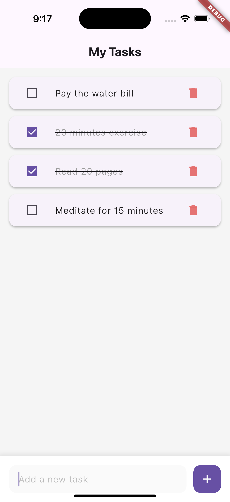

# Flutter Todo App

A clean and minimalist Todo application built with Flutter. This app helps users manage their daily tasks with a simple and intuitive interface.

## Features

- ✨ Create new tasks
- ✅ Mark tasks as completed
- 🗑️ Delete tasks
- 💫 Clean and modern UI
- ⚡ Fast and responsive

## Screenshots

 

## Getting Started

### Prerequisites

- Flutter SDK (2.0.0 or higher)
- Dart SDK (2.12.0 or higher)
- An IDE (VS Code, Android Studio, or IntelliJ)

### Installation

1. Clone the repository
```bash
git clone https://github.com/yourusername/todo_flutter.git
```
2.  Navigate to the project directory
```bash
cd todo_flutter
```
3.  Install dependencies
```bash
flutter pub get
```
4.  Run the app
```bash
flutter run 
```
